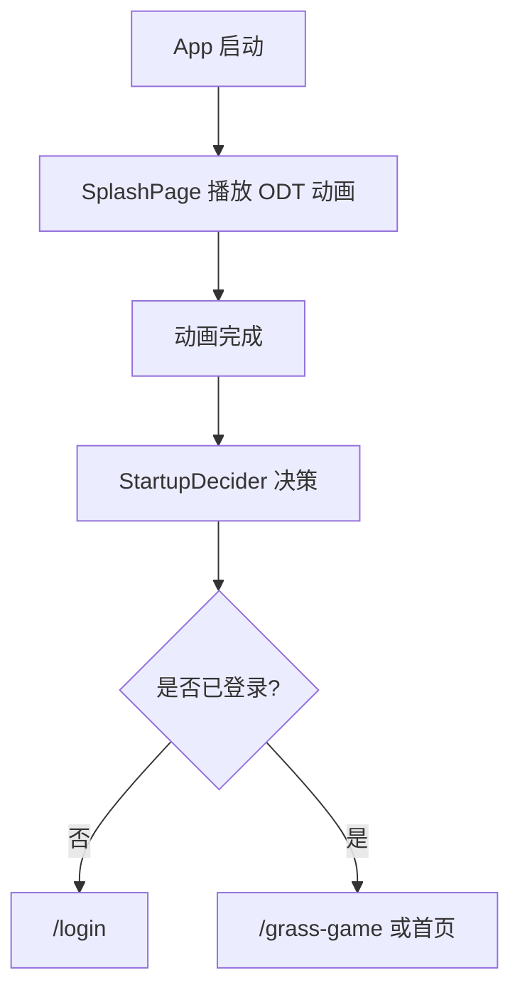

# ODT 闪屏动画设计

> 目标：设计一个类似 Gmail 启动时字母标识展开的 ODT 品牌闪屏。动画只使用本地资源和本地绘制，不请求网络、不读取设备信息；播放完成后进入海外登录页或主页面。

## 1. 视觉方向

### 1.1 Visual thesis

ODT 闪屏应像三段能量轨迹合成一个稳定标识：`O` 先形成入口，`D` 从右侧展开，`T` 最后落下定型，整体克制、清晰、可信，不做复杂粒子和长动画。

### 1.2 品牌动效概念

参考 Gmail `M` 启动动效的思路：不是直接淡入 logo，而是让 logo 的几段结构按顺序绘制、拼合、定格。

ODT 可拆成 5 段：

```text
O: 一条闭合圆角环线
D: 一条左竖线 + 一条右侧半圆弧
T: 一条顶部横线 + 一条中竖线
```

动画顺序：

```text
O 环线绘制
  -> D 竖线出现
  -> D 弧线展开
  -> T 横线滑入
  -> T 竖线落下
  -> ODT 整体轻微呼吸定格
  -> 跳转下一页
```

## 2. 页面结构

```text
SplashPage
  ├── OdtSplashAnimation
  │   └── CustomPaint / Rive / Lottie
  └── SplashController
      ├── 播放动画
      ├── 等待最小时长
      └── 请求启动路由决策
```

第一版推荐 Flutter 原生实现：

- `AnimationController`
- `CustomPainter`
- `PathMetric.extractPath`
- `go_router` 跳转

原因：

- 不依赖外部动画 SDK。
- 不需要网络资源。
- 可以严格控制动画完成回调。
- 启动阶段足够轻量。

如果后续设计师给 Rive/Lottie 源文件，可替换 `OdtSplashAnimation` 内部实现，但 `SplashPage` 和路由决策不变。

## 3. 动画时间轴

总时长建议：`1600ms - 2200ms`。不要超过 2500ms，避免启动拖沓。

| 时间 | 动画 | 说明 |
| ---: | --- | --- |
| 0-180ms | 背景淡入 | 深色或纯白背景进入 |
| 120-620ms | `O` 环线绘制 | 从左上开始顺时针闭合 |
| 420-820ms | `D` 左竖线绘制 | 与 O 有轻微错位重叠 |
| 650-1100ms | `D` 右弧线展开 | 从上到下画出半圆 |
| 920-1250ms | `T` 顶部横线滑入 | 从左到右，轻微 overshoot |
| 1100-1450ms | `T` 中竖线落下 | 从横线中心向下绘制 |
| 1450-1750ms | 整体定格呼吸 | scale 1.0 -> 1.025 -> 1.0 |
| 1750ms+ | 路由跳转 | fade 或无缝切换下一页 |

建议 easing：

```text
曲线绘制：Curves.easeOutCubic
横线滑入：Curves.easeOutBack
定格呼吸：Curves.easeInOut
页面退出：Curves.easeOut
```

## 4. 版式设计

### 4.1 背景

两套可选：

#### 方案 A：深色游戏感

```text
background: #08120E
logo primary: #E8FFF2
accent: #49D17D
```

适合游戏启动，更有沉浸感。

#### 方案 B：白底品牌感

```text
background: #FFFFFF
logo primary: #102418
accent: #22C55E
```

适合更通用、更轻的 App 品牌启动。

当前小游戏建议用方案 A。

### 4.2 尺寸

```text
logoWidth = min(screenWidth * 0.46, 220)
strokeWidth = logoWidth * 0.075
cornerRadius = strokeWidth * 1.2
```

位置：

```text
centerX = screenWidth / 2
centerY = screenHeight * 0.46
```

底部可选小字：

```text
ODT
```

如果 ODT logo 本身已经清晰，不加小字，避免重复。

## 5. 路由与启动流程

闪屏不是业务入口，只是启动过渡。动画结束后交给 `StartupDecider`：



`go_router` 建议路由：

```text
/splash
/login
/grass-game
```

根 App：

```text
initialLocation: /splash
```

## 6. 启动边界

闪屏播放期间允许：

- 本地绘制动画。
- 读取本地登录 token 是否存在。
- 读取本地语言/主题设置。

闪屏播放期间禁止：

- 发起网络请求。
- 上报启动埋点。
- 请求权限。
- 读取设备标识。

不要把网络请求、权限请求或埋点上报塞进 `main()`、`SplashPage.initState()` 或 logo 动画组件。

## 7. Flutter 实现建议

### 7.1 包位置

建议新增：

```text
packages/
  app_splash/
    lib/
      app_splash.dart
      src/presentation/odt_splash_page.dart
      src/presentation/odt_splash_animation.dart
      src/presentation/odt_logo_painter.dart
      src/application/startup_decider.dart
```

依赖方向：

```text
app
  -> app_splash
  -> app_auth

app_splash
  -> app_core
  -> app_i18n 可选
```

`app_splash` 不依赖 `grass_game_*`，避免启动页知道游戏实现。

### 7.2 动画组件 API

```dart
class OdtSplashAnimation extends StatefulWidget {
  const OdtSplashAnimation({
    super.key,
    required this.onCompleted,
  });

  final VoidCallback onCompleted;
}
```

### 7.3 CustomPainter 数据

```dart
class OdtLogoPainter extends CustomPainter {
  OdtLogoPainter({
    required this.oProgress,
    required this.dLineProgress,
    required this.dCurveProgress,
    required this.tTopProgress,
    required this.tStemProgress,
  });
}
```

每一段 progress 都是 `0..1`，由同一个 `AnimationController` interval 拆分。

### 7.4 跳转策略

动画完成后不要在 painter 内跳转，由 page/controller 处理：

```dart
void _handleSplashCompleted() async {
  final route = await startupDecider.nextRoute();
  if (!mounted) return;
  context.go(route);
}
```

## 8. 页面转场

推荐：

- Splash -> Login：背景色延续，登录页内容从底部上移。
- Splash -> Home/Game：短 fade，避免多段复杂转场。

不要：

- 动画没播完就跳转。
- 同时启动多个页面跳转。
- 动画页和登录页都各自做长转场。

## 9. 性能要求

- 只用矢量路径和本地颜色，首帧不加载大图。
- 动画每帧不分配大量对象；Path 可缓存或按尺寸重建。
- 支持 60fps。
- 总时长不超过 2.2s。
- App 从冷启动到首帧不要等待网络。

## 10. 测试与验收

自动化：

- Widget test：动画完成后调用 `onCompleted`。
- StartupDecider test：不同隐私/登录状态返回正确 route。
- Router test：初始路由是 `/splash`。

手工：

- 冷启动能看到完整 ODT 动画。
- 动画完成后才跳转。
- 首次启动动画完成后进入海外登录页。
- 闪屏期间没有网络请求、权限弹窗和埋点。
- 小屏和高刷设备动画不裁切、不闪烁。

## 11. 文案

闪屏默认不展示文案。若必须展示：

```text
ODT
```

不要展示 slogan，避免拉长停留时间和多语言负担。

## 12. 后续升级

第一版：Flutter `CustomPainter`。

第二版：如果设计师输出 Rive，可只替换 `OdtSplashAnimation`，保留 `SplashPage`、`StartupDecider`、路由和合规门禁不变。

第三版：根据品牌活动支持节日皮肤，但仍必须本地内置，不依赖启动时网络下载。
