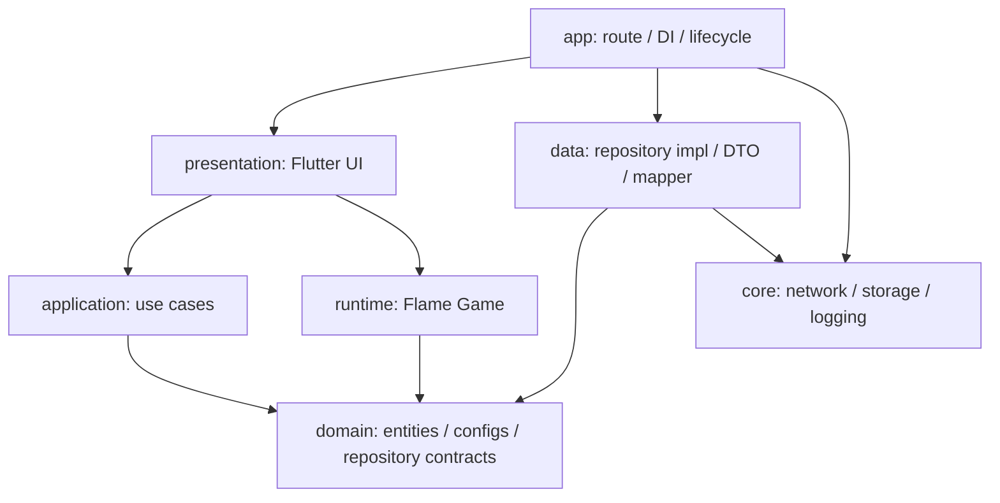

# Flutter + Flame 大型项目架构设计

> 目标：让当前割草小游戏从 Demo 结构平滑扩展到长期维护的大型项目。架构重点是模块边界清晰、依赖方向稳定、玩法可扩展、网络与存储可替换、性能路径可控。

## 1. 总体原则

- 业务 UI、玩法领域、Flame 运行时、数据访问、基础设施分层隔离。
- 依赖方向只能从外层指向内层：`presentation -> application -> domain`，`data` 实现 `domain` 抽象。
- 游戏高频逻辑不依赖 Flutter Widget、HTTP、磁盘、平台 Channel。
- 新增敌人、武器、技能、波次优先通过独立类和配置扩展，不把分支堆进一个大类。
- 当前工程已采用本地 packages 拆分；新增游戏能力优先进入对应 package，根 App 只保留入口、路由和装配。

## 2. 推荐分层

```text
lib/
  main.dart
  app/
    app.dart
    router/
    di/
packages/
  app_core/
    lib/
      src/error/
      src/result/
      src/logging/
      src/lifecycle/
      src/network/
      src/storage/
      src/analytics/
  app_i18n/
    lib/
      app_i18n.dart
      src/l10n/
  app_splash/
    lib/src/application/
    lib/src/presentation/
  app_auth/
    lib/src/domain/
    lib/src/application/
    lib/src/data/
    lib/src/presentation/
  grass_game_domain/
    lib/src/domain/
  grass_game_data/
    lib/src/data/
  grass_game_runtime/
    lib/src/runtime/
  grass_game_ui/
    lib/src/application/
    lib/src/presentation/
```

### 2.1 app 层

职责：

- 应用入口、路由注册、主题、全局依赖注入。
- 路由统一使用 `go_router`，入口集中在 `lib/app/router/app_router.dart`。
- 只装配模块，不写具体玩法规则。
- 统一处理 App 生命周期，并把暂停/恢复事件下发给游戏模块。

限制：

- 不直接依赖 Flame Component。
- 不直接发起游戏配置请求。
- 不写敌人、武器、技能等业务逻辑。

### 2.2 core 层

职责：

- 提供跨模块基础设施抽象，例如网络、缓存、日志、埋点、错误模型、Result 类型。
- 可以放通用工具，但必须稳定、无具体游戏业务含义。

建议接口：

```dart
abstract interface class HttpClient {
  Future<HttpResponse> get(String path, {Map<String, dynamic>? query});
}

abstract interface class KeyValueStore {
  Future<String?> readString(String key);
  Future<void> writeString(String key, String value);
}

abstract interface class AnalyticsReporter {
  void report(String eventName, Map<String, Object?> params);
}
```

限制：

- `core` 不反向依赖 `features`。
- 不为了复用提前放入只被一个模块使用的代码。

### 2.3 i18n 层

职责：

- 提供 App 通用多语言文案、支持语言列表和 Flutter localization delegates。
- 使用 Flutter 官方 `gen_l10n` 和 ARB 文件生成类型安全访问类。
- 供 App 壳和 UI package 使用。

限制：

- `domain`、`runtime`、`data` 不依赖 `app_i18n`。
- 游戏规则、远程配置 id、埋点 key 不使用本地化文案。

详细规则见 `doc/architecture/多语言架构设计.md`。

### 2.4 splash/auth 层

职责：

- `app_splash` 负责 ODT 启动动画、启动路由决策入口和动画完成回调。
- `app_auth` 负责 Google Play、Apple、Facebook、邮箱登录页面和登录能力编排。
- App 壳只做路由和依赖装配，不直接初始化第三方登录 SDK。

限制：

- 闪屏动画期间只允许本地绘制和本地状态读取，不发网络、不上报埋点。
- 当前只面向海外版本，登录入口以 `app_auth` 允许列表为准。
- 登录方式展示由 platform 和 feature flag 决定，Widget 不到处写平台判断。

详细规则见 `doc/architecture/ODT闪屏动画设计.md`。
详细规则见 `doc/architecture/海外登录页面设计.md`。

### 2.5 presentation 层

职责：

- Flutter 页面、HUD、升级弹窗、暂停弹窗、结算面板。
- 处理用户输入和 UI 状态。
- 持有 `GameWidget`，通过 controller 与 Flame runtime 通信。

建议结构：

```text
presentation/
  pages/
    grass_game_page.dart
  controllers/
    grass_game_page_controller.dart
  widgets/
    grass_game_hud.dart
    virtual_joystick.dart
    level_up_panel.dart
    game_result_panel.dart
```

限制：

- Widget 不直接修改 Component 列表。
- Widget 不直接解析远程 DTO。
- 高频状态不要用 `setState` 每帧刷新；HUD 只监听必要的快照字段。

### 2.6 application 层

职责：

- 组织一次用例流程，例如进入游戏、加载配置、开始战斗、提交结算、领取奖励。
- 连接 presentation、domain repository、runtime controller。
- 处理流程编排，不实现具体碰撞、寻敌、刷怪算法。

建议结构：

```text
application/
  use_cases/
    load_grass_game_config.dart
    start_grass_game.dart
    submit_grass_game_result.dart
  services/
    grass_game_session_service.dart
```

典型流程：

```text
GrassGamePage
  -> LoadGrassGameConfigUseCase
  -> GameConfigRepository
  -> GrassGameRuntimeController.start(config)
```

### 2.7 domain 层

职责：

- 放核心业务模型、配置模型、规则接口和仓储抽象。
- 不能依赖 Flutter、Flame、HTTP、shared_preferences、平台代码。
- 适合单元测试。

建议结构：

```text
domain/
  entities/
    game_result.dart
    enemy_profile.dart
    skill_profile.dart
    weapon_profile.dart
  value_objects/
    hp.dart
    damage.dart
    cooldown.dart
    game_time.dart
  configs/
    game_balance.dart
    enemy_config.dart
    wave_config.dart
    skill_config.dart
  repositories/
    game_config_repository.dart
    game_record_repository.dart
  services/
    skill_option_selector.dart
    reward_calculator.dart
```

限制：

- 不出现 `BuildContext`、`Component`、`Vector2`、`Dio`、`SharedPreferences`。
- 领域模型优先不可变；运行时可变状态放 `runtime`。

### 2.8 data 层

职责：

- 实现 domain 层的 repository。
- 处理远程接口、本地缓存、DTO、mapper、版本兼容。
- 把外部数据转换成 domain config。

建议结构：

```text
data/
  dto/
    game_config_dto.dart
    enemy_config_dto.dart
  mappers/
    game_config_mapper.dart
  sources/
    remote_game_config_source.dart
    local_game_config_cache.dart
  repositories/
    game_config_repository_impl.dart
```

配置加载策略：

```text
1. 读取本地默认配置
2. 读取上一次有效缓存
3. 请求远程配置
4. 校验版本和字段
5. 成功后更新缓存
6. 失败时使用缓存或默认配置
```

限制：

- data 层不把 DTO 泄漏给 presentation 或 runtime。
- 网络错误、JSON 错误、版本错误必须转换为可控结果，不能让游戏入口崩溃。

### 2.9 runtime 层

职责：

- Flame 游戏运行时，包括 `FlameGame`、Component、System、对象池、碰撞、动画、输入适配。
- 只接收 domain config 和 application 指令。
- 通过事件或快照把状态暴露给 Flutter UI。

建议结构：

```text
runtime/
  game/
    grass_survivor_game.dart
    grass_game_runtime_controller.dart
    grass_game_runtime_state.dart
  components/
    player_component.dart
    enemy_component.dart
    projectile_component.dart
    exp_gem_component.dart
  systems/
    enemy_spawn_system.dart
    targeting_system.dart
    weapon_system.dart
    collision_system.dart
    exp_system.dart
    skill_system.dart
    wave_system.dart
  performance/
    object_pool.dart
    spatial_hash_grid.dart
  events/
    runtime_event.dart
    level_up_event.dart
    game_over_event.dart
  snapshots/
    hud_snapshot.dart
```

限制：

- runtime 不发 HTTP，不读写磁盘，不直接上报埋点。
- runtime 不持有 `BuildContext`。
- runtime 不直接弹 Flutter 弹窗，只发事件。

## 3. 模块依赖图



依赖规则：

- `domain` 是核心，不依赖任何外部层。
- `runtime` 可以依赖 `domain`，但不能依赖 `data`。
- `presentation` 可以依赖 `application` 和 `runtime controller`，不直接依赖 `data`。
- `data` 实现 `domain` 的 repository 抽象，由 DI 注入给 use case。

## 4. 状态管理建议

大型项目建议选择一种统一状态管理方案：

- 推荐：`riverpod`，适合依赖注入、异步配置加载、页面状态组合和测试。
- 可选：`bloc`，适合事件流严格、团队已有 BLoC 规范的项目。
- 小范围 UI 状态仍可用局部 `StatefulWidget`，例如按钮 hover、短暂动画状态。

不要混用多套全局状态管理。Flame runtime 内部状态不进入全局状态树，只暴露必要快照：

```text
Runtime mutable state
  -> HudSnapshot
  -> ValueListenable / Stream / StateNotifier
  -> Flutter HUD
```

## 5. 依赖注入

大型项目必须显式装配依赖，避免在类内部 `new` 具体实现。

建议：

```text
app/di/
  core_providers.dart
  grass_game_providers.dart
```

示例关系：

```text
HttpClient
KeyValueStore
AnalyticsReporter
  -> RemoteGameConfigSource
  -> LocalGameConfigCache
  -> GameConfigRepositoryImpl
  -> LoadGrassGameConfigUseCase
  -> GrassGamePageController
```

规则：

- domain 定义接口。
- data 提供实现。
- app/di 负责绑定。
- runtime 所需配置由 application 传入，不自己查找依赖。

## 6. 网络架构

当前项目没有既有网络层。大型项目推荐做成可替换适配层：

```text
packages/app_core/lib/src/network/
  http_client.dart

packages/grass_game_data/lib/src/data/
  sources/
  dto/
  mappers/
```

请求规范：

- 所有接口由 data source 发起。
- Repository 返回 domain model 或 `Result<T>`，不抛未处理异常给 UI。
- DTO 字段必须做空值、版本、范围校验。
- 配置请求只发生在进入游戏前、刷新配置时或后台预拉取时。
- 禁止在 Flame `update(dt)` 中请求网络。

远程配置建议字段：

```json
{
  "version": 1,
  "minClientVersion": "1.0.0",
  "balance": {},
  "enemies": [],
  "waves": [],
  "skills": [],
  "featureFlags": {}
}
```

## 7. 事件与埋点

runtime 只产出游戏事件：

```text
GameStarted
LevelUpOptionsGenerated
SkillSelected
GamePaused
GameResumed
GameOver
```

application 或 presentation 决定是否埋点：

```text
runtime event -> application event handler -> AnalyticsReporter
```

规则：

- 命中、拾取、每帧伤害等高频事件不实时上报。
- 结算时聚合上报总击杀、存活时间、技能选择、伤害统计。
- 奖励领取和服务端结算走 application use case，不放 runtime。

## 8. 扩展点设计

### 8.1 新增敌人

```text
domain: EnemyConfig / EnemyProfile
runtime: EnemyComponent subclass or behavior strategy
data: enemy DTO mapper
```

推荐用行为策略扩展：

```dart
abstract interface class EnemyBehavior {
  void update(EnemyRuntimeContext context, double dt);
}
```

### 8.2 新增武器

```text
domain: WeaponConfig / WeaponProfile
runtime: WeaponSystem + WeaponEmitter
assets: projectile image / effect
```

推荐接口：

```dart
abstract interface class WeaponEmitter {
  void tick(WeaponRuntimeContext context, double dt);
}
```

### 8.3 新增技能

```text
domain: SkillProfile / SkillEffect
runtime: SkillSystem applies effect
presentation: skill card rendering
data: skill DTO mapper
```

技能效果不要写成字符串解释器；复杂技能应有明确类和配置参数。

### 8.4 新增关卡或活动

```text
domain: StageConfig / ActivityConfig
data: activity config source
application: load activity use case
runtime: wave system consumes config
```

活动规则、奖励资格、反作弊校验不放 runtime。

## 9. 测试策略

按层测试：

- domain：纯 Dart 单元测试，覆盖配置校验、奖励计算、技能候选生成。
- data：DTO mapper、配置兼容、缓存兜底、失败降级。
- application：用 mock repository 测流程。
- runtime：系统级测试，覆盖刷怪、瞄准、碰撞、升级触发。
- presentation：Widget test 覆盖 HUD、弹窗和结算展示。
- 真机：覆盖手感、性能、生命周期、音效、资源加载。

最低要求：

```bash
flutter analyze
flutter test
```

涉及性能路径时补充：

- 同屏敌人、子弹、掉落物数量压力测试。
- 暂停/恢复、切后台、返回页面的生命周期测试。
- 低端机帧率和对象创建数量检查。

## 10. 后续演进

### 阶段 A：保持包边界

新增代码先判断归属包：App 壳、core、domain、data、runtime 或 ui。不要因为调用方便把游戏能力重新写回根 App。

### 阶段 B：稳定接口

当配置、埋点、缓存、奖励接口变化时，优先调整 domain contract，再由 data/ui/runtime 适配。

### 阶段 C：补 package 测试

每个 package 保留可单独 `dart analyze` 或 `flutter analyze` 的状态；domain、data、runtime 逐步补单元测试。

### 阶段 D：升级为 monorepo 工具链

当 package 数量继续增长时，再引入 melos 等 workspace 工具统一执行 pub get、analyze、test：

```text
packages/
  app_core/
  grass_game_domain/
  grass_game_data/
  grass_game_runtime/
  grass_game_ui/
```

## 11. 禁止事项

- 禁止在 `FlameGame` 或 Component 中直接写 HTTP、缓存、埋点、路由跳转。
- 禁止把所有玩法写进一个 `GrassSurvivorGame` 大类。
- 禁止用一个全能 `GameManager` 管敌人、武器、掉落、网络、UI、埋点。
- 禁止让远程 JSON 动态解释复杂逻辑。
- 禁止让 DTO 穿透到 domain、runtime 或 presentation。
- 禁止没有默认配置就依赖远程接口启动游戏。
- 禁止新增多套状态管理、网络封装或缓存封装。

## 12. 推荐最终结构

```text
lib/
  main.dart
  app/
    app.dart
    router/app_router.dart
    di/core_providers.dart
    di/grass_game_providers.dart
packages/
  app_core/
    lib/app_core.dart
    lib/src/error/
    lib/src/result/
    lib/src/network/
    lib/src/storage/
    lib/src/analytics/
    lib/src/logging/
  app_i18n/
    lib/app_i18n.dart
    lib/src/l10n/
  app_splash/
    lib/app_splash.dart
    lib/src/application/
    lib/src/presentation/
  app_auth/
    lib/app_auth.dart
    lib/src/domain/
    lib/src/application/
    lib/src/data/
    lib/src/presentation/
  grass_game_domain/
    lib/grass_game_domain.dart
    lib/src/domain/entities/
    lib/src/domain/value_objects/
    lib/src/domain/configs/
    lib/src/domain/repositories/
    lib/src/domain/services/
  grass_game_data/
    lib/grass_game_data.dart
    lib/src/data/dto/
    lib/src/data/mappers/
    lib/src/data/sources/
    lib/src/data/repositories/
  grass_game_runtime/
    lib/grass_game_runtime.dart
    lib/src/runtime/game/
    lib/src/runtime/components/
    lib/src/runtime/systems/
    lib/src/runtime/performance/
    lib/src/runtime/events/
    lib/src/runtime/snapshots/
  grass_game_ui/
    lib/grass_game_ui.dart
    lib/src/application/use_cases/
    lib/src/application/services/
    lib/src/presentation/pages/
    lib/src/presentation/controllers/
    lib/src/presentation/widgets/
```

这套结构的关键不是目录多，而是依赖方向稳定：玩法核心可以脱离 UI、网络和存储独立测试；Flutter UI 可以替换；远程配置可以替换；Flame runtime 可以随着玩法复杂度扩展。
