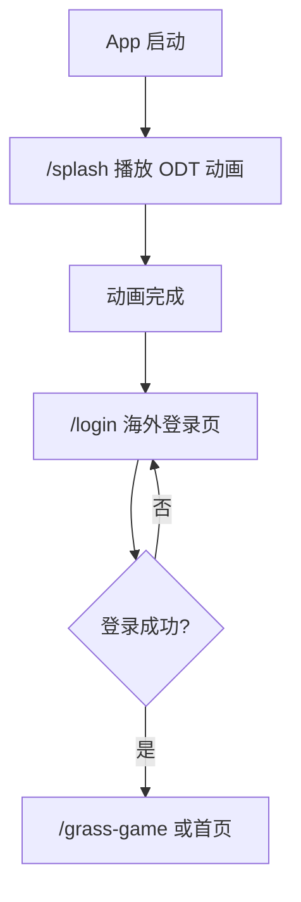

# 海外登录页面设计

> 目标：当前产品只面向海外版本。登录体系保留 Android Google Play、iOS Apple、Facebook 和 Email。

## 1. 产品范围

```text
Global Android
  -> Google Play 登录
  -> Facebook 登录
  -> Email 登录

Global iOS
  -> Apple 登录
  -> Facebook 登录
  -> Email 登录
```

## 2. 启动流程



启动阶段只做本地动画和本地页面跳转；第三方登录 SDK 后续接入时按用户点击对应按钮后再触发。

## 3. 登录页结构

### 3.1 Android Global

```text
沉浸式 ODT 游戏背景
ODT 标识
Start your run
Sign in to sync progress and rewards.

Continue with Google Play
Continue with Facebook
or
Continue with Email

Terms / Privacy Policy
```

规则：

- Android 不展示 Apple 登录。
- Google Play 是主入口。
- Facebook 和 Email 是 fallback。
- Google Play 服务不可用时隐藏 Google Play，保留 Facebook 和 Email。

### 3.2 iOS Global

```text
沉浸式 ODT 游戏背景
ODT 标识
Start your run
Sign in to sync progress and rewards.

Continue with Apple
Continue with Facebook
or
Continue with Email

Terms / Privacy Policy
```

规则：

- iOS 不展示 Google Play 登录。
- Apple 登录是主入口。
- Facebook 和 Email 是 fallback。
- Apple 登录按钮后续接入时需遵守 Apple 样式要求。

### 3.3 Email 登录

```text
返回
Continue with Email
Email
Verification code
Sign in
```

第一版使用 fake 登录或邮箱验证码模型；暂不做密码体系。

## 4. 包结构

```text
packages/
  app_splash/
    lib/src/presentation/odt_splash_page.dart
    lib/src/presentation/odt_splash_animation.dart
    lib/src/application/startup_decider.dart

  app_auth/
    lib/src/domain/auth_provider_type.dart
    lib/src/domain/auth_session.dart
    lib/src/application/fake_auth_controller.dart
    lib/src/presentation/global_login_page.dart
    lib/src/presentation/email_login_page.dart
```

根 App 只负责路由装配：

```text
/splash
/login
/login/email
/grass-game
```

## 5. 登录 Provider 策略

```dart
enum AuthProviderType {
  googlePlay,
  apple,
  facebook,
  email,
}
```

展示矩阵：

| 平台 | 主入口 | 其他入口 |
| --- | --- | --- |
| Android | Google Play | Facebook, Email |
| iOS | Apple | Facebook, Email |

Widget 只根据 `Theme.of(context).platform` 或后续注入的 platform policy 显示入口。

## 6. UI 规范

- 登录页保持深色沉浸背景，和 ODT 闪屏颜色连续。
- 主按钮高度 52-56，圆角 12。
- 只保留一个主入口、一个社交 fallback 和一个 Email fallback。
- 协议入口放底部，文案为 `Terms` / `Privacy Policy`。
- 文案后续接入 `app_i18n`，当前可先保留英文。

## 7. Fake 登录阶段

当前实现阶段：

- 点击 Google Play / Apple / Facebook，等待 700ms 后返回 fake session。
- Email 页默认填充 demo 邮箱和验证码。
- fake 登录成功后进入 `/grass-game`。

后续真实接入：

- `GooglePlayAuthProvider`
- `AppleAuthProvider`
- `FacebookAuthProvider`
- `EmailAuthProvider`

真实 SDK 接入时保持 provider 抽象，不把 SDK 调用写进 Widget。

## 8. 验收清单

- 冷启动先显示 native ODT 背景，再显示 `/splash` ODT 动画。
- 动画完成后直接进入海外登录页。
- Android 登录页不出现 Apple。
- iOS 登录页不出现 Google Play。
- Facebook 和 Email 两端都可见。
- fake 登录成功后进入游戏页。
- `flutter analyze`、`flutter test`、`flutter build apk --debug` 通过。
