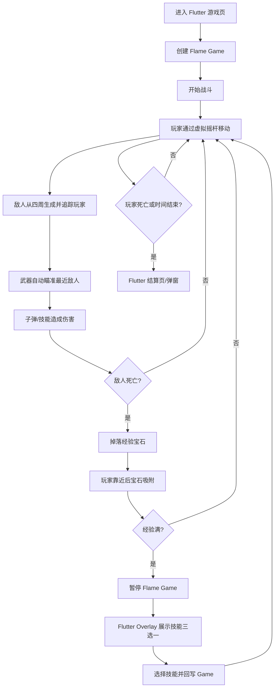

# App 内 Flutter + Flame 割草类小游戏完整设计方案

> 目标：把原先的 WebView/H5 小游戏方案调整为 Flutter 代码内直接使用 Flame 游戏引擎实现。游戏仍然是“割草 + 自动射击 + 肉鸽升级”玩法，但承载方式从 H5 WebView 改为 Flutter 页面 + Flame `GameWidget`，减少 WebView、JSBridge、H5 兼容层带来的复杂度。

---

## 1. 结论

如果这款小游戏主要服务当前 Flutter App 内部使用，建议采用：

```text
Flutter + Flame
Dart 实现核心玩法
Flame Component 承载玩家、敌人、子弹、经验、技能
Flutter Widget/Overlay 承载 HUD、升级三选一、暂停、结算
远程 JSON 控制数值、波次、技能池，减少发版调参成本
```

不再优先使用：

```text
WebView + H5 + Phaser + JSBridge
```

原因：

- 游戏运行在 Flutter 页面中，App 内体验更一致。
- 不需要 WebView 生命周期、JSBridge、H5 缓存和浏览器兼容处理。
- 游戏结束、埋点、奖励、路由跳转可以直接走 Dart 调用。
- Flutter 团队维护成本更低。
- Flame 本身提供 game loop、组件系统、碰撞、输入、动画、粒子、sprite/spritesheet 等 2D 游戏常用能力。

保留 H5 方案的场景：

- 希望游戏像活动页一样不发版频繁更新完整玩法。
- 需要游戏独立在浏览器、微信、外部链接中运行。
- 团队 Web 游戏经验明显强于 Flutter。

对当前 App 内小游戏，推荐 `Flutter + Flame + 远程配置`。

---

## 2. 技术选型

### 2.1 核心依赖

| 能力 | 推荐技术 | 用途 |
| --- | --- | --- |
| 2D 游戏引擎 | `flame` | 游戏循环、组件、碰撞、动画、相机、输入 |
| 音效 | `flame_audio` 或现有音频能力 | 射击、拾取、升级、受击、结算音效 |
| 状态管理 | 复用当前 Flutter 项目已有模式，如 `Provider`/局部 `StatefulWidget` | 页面状态、结算、技能弹窗 |
| 本地存档 | `shared_preferences` | 音效开关、最高分、本地设置 |
| 资源管理 | Flutter assets + Flame images/audio cache | 图片、图集、音频 |
| 远程配置 | 现有 `service_common`/业务接口 | 敌人、波次、技能数值、活动开关 |
| 埋点 | 现有 App 埋点能力 | 进入、开始、升级、技能选择、结算 |

### 2.2 不建议第一版引入的依赖

| 依赖 | 原因 |
| --- | --- |
| `flame_forge2d` | 割草游戏不需要复杂刚体物理，圆形碰撞足够 |
| 第三方 ECS 框架 | 第一版会增加抽象成本，先用 Flame Component + System 管理 |
| 复杂骨骼动画运行时 | MVP 先用 spritesheet，稳定后再考虑 Spine/Rive |
| 自研渲染层 | Flame 已满足 2D 场景需求 |

---

## 3. 在当前 Flutter 工程中的落点

根据当前 `kkhc_flutter` 工作区规则，建议落点如下：

| 类型 | 建议位置 | 说明 |
| --- | --- | --- |
| 游戏入口页面 | `my_flutter_module/lib/<业务模块>/grass_game/grass_game_page.dart` | Flutter 页面，内部放 `GameWidget` |
| 游戏核心代码 | `my_flutter_module/lib/<业务模块>/grass_game/game/` | Flame game、components、systems、data |
| 路由注册 | `my_flutter_module/lib/router/app_routes.dart` | 新增小游戏页面 route |
| 业务专属资源 | `my_flutter_module/assets/game/grass_game/` | 如果只给这个页面用 |
| 公共图片资源 | `res_common/assets/image/` | 如果多个模块复用，需生成 `ImageAssets` |
| 通用 UI 组件 | `ui_common/lib/` | 只有跨业务复用时再放这里 |
| 远程配置 DTO/模型 | `remote_service_common`、`domain_common`、`service_common` | 只有接后端配置时再按分层新增 |

第一版如果只是本地 Demo，建议先放在 `my_flutter_module` 内，不要提前拆到多个包。

---

## 4. 游戏玩法总览

### 4.1 核心循环



### 4.2 玩家操作

第一版推荐：

- 左下角虚拟摇杆。
- 手指拖动控制方向。
- 松手停止移动。
- 攻击全部自动释放。

后续可加：

- 全屏拖拽移动。
- 键盘调试移动。
- 手柄支持，非必须。

---

## 5. Flutter + Flame 架构

### 5.1 页面结构

```text
GrassGamePage
  ├── GameWidget<GrassSurvivorGame>
  ├── HUD Overlay
  │   ├── HP
  │   ├── EXP
  │   ├── Level
  │   ├── Time
  │   └── KillCount
  ├── LevelUp Overlay
  │   └── SkillCard x 3
  ├── Pause Overlay
  └── Result Overlay
```

### 5.2 Flame Game 结构

```text
GrassSurvivorGame extends FlameGame
  ├── PlayerComponent
  ├── EnemyManager
  ├── ProjectileManager
  ├── DropManager
  ├── WeaponSystem
  ├── SkillSystem
  ├── CollisionSystem
  ├── WaveSystem
  ├── SpatialHashGrid
  └── GameRuntimeState
```

### 5.3 推荐目录

```text
my_flutter_module/lib/<业务模块>/grass_game/
  grass_game_page.dart
  grass_game_route_args.dart
  game/
    grass_survivor_game.dart
    grass_game_controller.dart
    grass_game_state.dart
    config/
      enemy_config.dart
      weapon_config.dart
      skill_config.dart
      wave_config.dart
      game_balance.dart
    components/
      player_component.dart
      enemy_component.dart
      projectile_component.dart
      exp_gem_component.dart
      orbit_weapon_component.dart
      laser_component.dart
      damage_text_component.dart
    systems/
      input_system.dart
      enemy_spawn_system.dart
      targeting_system.dart
      weapon_system.dart
      projectile_system.dart
      collision_system.dart
      exp_system.dart
      skill_system.dart
      drop_system.dart
      wave_system.dart
      spatial_hash_grid.dart
      object_pool.dart
    data/
      enemy_runtime.dart
      weapon_runtime.dart
      skill_runtime.dart
      game_result.dart
  widgets/
    grass_game_hud.dart
    virtual_joystick.dart
    level_up_panel.dart
    skill_card.dart
    game_pause_panel.dart
    game_result_panel.dart
```

---

## 6. 核心系统设计

### 6.1 PlayerComponent

职责：

- 保存玩家位置、生命值、速度、等级、经验。
- 根据输入方向移动。
- 控制受击无敌时间。
- 暴露拾取范围、攻击倍率、冷却倍率等属性。

建议属性：

| 属性 | 初始值 | 说明 |
| --- | ---: | --- |
| `maxHp` | 100 | 最大生命 |
| `hp` | 100 | 当前生命 |
| `moveSpeed` | 180 | 像素/秒 |
| `pickupRange` | 90 | 宝石吸附范围 |
| `level` | 1 | 等级 |
| `exp` | 0 | 当前经验 |
| `attackMultiplier` | 1.0 | 攻击倍率 |
| `cooldownMultiplier` | 1.0 | 冷却倍率 |

### 6.2 EnemyComponent

职责：

- 从屏幕外生成。
- 朝玩家方向移动。
- 被子弹/技能命中后扣血。
- 死亡后通知 DropSystem 掉落经验。

敌人类型：

| 类型 | 行为 | 第一版是否做 |
| --- | --- | --- |
| 普通怪 | 直线追踪玩家 | 必做 |
| 快速怪 | 速度快、血少 | 必做 |
| 厚血怪 | 速度慢、血厚 | 必做 |
| 远程怪 | 保持距离发射弹幕 | 后续 |
| 精英怪 | 高血量、有词缀 | 后续 |
| Boss | 阶段技能、红圈预警 | 后续 |

### 6.3 TargetingSystem

职责：

- 自动查找最近敌人。
- 给弓箭、激光、雷电等技能提供目标。

第一版规则：

```text
每 100-200ms 重新选一次目标
只选 active 且 hp > 0 的敌人
按距离平方排序，避免频繁 sqrt
```

后续优化：

- 只在玩家附近空间网格内查找。
- 支持目标策略：
  - 最近敌人。
  - 血量最低。
  - 最远敌人。
  - 随机敌人。
  - Boss 优先。

### 6.4 WeaponSystem

职责：

- 管理所有武器冷却。
- 根据技能等级生成子弹、飞镖、激光。
- 应用玩家被动属性加成。

第一版武器：

- 弓箭：自动瞄准最近敌人并发射子弹。
- 旋转飞镖：围绕玩家旋转，接触敌人造成伤害。
- 激光：朝最近敌人方向释放持续伤害光束。

### 6.5 ExpSystem

职责：

- 敌人死亡后掉落经验宝石。
- 玩家靠近后宝石吸附。
- 拾取后增加经验。
- 经验满后升级。
- 通知 Flutter Overlay 展示技能三选一。

升级经验建议：

```dart
int requiredExp(int level) {
  return (10 * pow(level, 1.45)).floor();
}
```

### 6.6 SkillSystem

职责：

- 管理技能池。
- 管理玩家当前技能等级。
- 升级时随机生成 3 个可选技能。
- 技能选择后应用到 WeaponSystem 或 PlayerComponent。

第一版技能池：

| 技能 | 类型 | 作用 |
| --- | --- | --- |
| 弓箭强化 | 主武器 | 伤害、数量、穿透、攻速 |
| 旋转飞镖 | 环绕武器 | 近身保护 |
| 激光 | 指向武器 | 穿透清线 |
| 疾跑靴 | 被动 | 提升移速 |
| 磁力手套 | 被动 | 提升拾取范围 |
| 攻击手套 | 被动 | 提升伤害 |
| 冷却核心 | 被动 | 降低技能冷却 |

---

## 7. Flutter Overlay 设计

### 7.1 为什么 HUD 用 Flutter Widget

Flame 可以画 UI，但当前 App 已经是 Flutter 工程，HUD、弹窗、按钮、结算页用 Flutter Widget 更合适：

- 更容易适配安全区、字体、主题。
- 更容易复用现有组件。
- 技能三选一、结算页、按钮交互更像 App UI。
- 游戏核心逻辑留在 Flame，复杂 UI 留在 Flutter。

### 7.2 Overlay 划分

| Overlay | 触发 | 职责 |
| --- | --- | --- |
| `hud` | 游戏运行中 | 血条、经验条、等级、时间、击杀 |
| `levelUp` | 玩家升级 | 技能三选一，选择后恢复游戏 |
| `pause` | 点击暂停/切后台 | 暂停面板 |
| `result` | 死亡/通关 | 结算与奖励入口 |

### 7.3 状态同步

建议 `GrassSurvivorGame` 持有一个轻量 controller：

```dart
class GrassGameController extends ChangeNotifier {
  int level = 1;
  int exp = 0;
  int requiredExp = 10;
  int hp = 100;
  int maxHp = 100;
  int killCount = 0;
  Duration elapsed = Duration.zero;

  void updateHud(...) {
    notifyListeners();
  }
}
```

Flutter HUD 监听 controller，避免每一帧都 setState。可以控制为每 100ms 或关键事件刷新。

---

## 8. 生命周期设计

### 8.1 App 生命周期

Flutter 页面需要处理：

- 页面进入：创建 game。
- 页面离开：销毁或暂停 game。
- App 切后台：暂停 game 和音频。
- App 回前台：恢复或保持暂停面板。
- 弹出技能选择：暂停 game。
- 弹出结算：停止 game。

### 8.2 不再需要 JSBridge

H5 方案中需要：

```text
H5 -> JSBridge -> App
App -> JSBridge -> H5
```

Flame 方案中改为：

```text
Flame Game -> Dart callback/controller -> Flutter Page -> 原有业务逻辑
```

例如：

```dart
GrassSurvivorGame(
  onLevelUp: (options) => showLevelUpOverlay(options),
  onGameOver: (result) => showResultOverlay(result),
  onTrackEvent: (event) => track(event),
)
```

---

## 9. 性能设计

### 9.1 目标

| 设备 | 目标 |
| --- | --- |
| 中高端 Android/iOS | 稳定 60 FPS |
| 中低端 Android | 30-60 FPS |
| 低端机 | 不低于 30 FPS，自动降级 |

### 9.2 必做优化

- 对敌人、子弹、经验宝石、伤害数字使用对象池。
- 碰撞使用圆形距离判断，不用复杂物理。
- 最近敌人查询不要每帧全量排序。
- 敌人多时使用空间网格。
- 伤害数字、粒子、爆炸特效设置数量上限。
- 远处敌人可以降低动画刷新频率。
- 暂停、切后台、升级弹窗时停止游戏更新。

### 9.3 实体数量建议

| 实体 | MVP 上限 | 优化后上限 |
| --- | ---: | ---: |
| 敌人 | 100 | 250-300 |
| 子弹 | 80 | 180-220 |
| 经验宝石 | 120 | 300-400 |
| 伤害数字 | 20 | 60 |
| 粒子/特效 | 30 | 80 |

### 9.4 Flame 碰撞策略

MVP 可以先用 Flame 的 collision callbacks 做简单碰撞验证。

中后期建议关键战斗碰撞改成自定义系统：

```text
ProjectileSystem 更新子弹
SpatialHashGrid 注册敌人
CollisionSystem 查询子弹附近敌人
按圆形半径判断命中
命中后扣血、穿透计数、回收子弹
```

原因：割草游戏后期实体数量大，自定义碰撞更可控。

---

## 10. 远程配置设计

### 10.1 为什么需要远程配置

Flutter + Flame 的缺点是“新增机制通常要发版”。但数值、波次、敌人血量、技能权重可以远程配置，减少调平衡发版。

适合远程配置：

- 敌人 HP、速度、伤害、经验。
- 波次时间轴。
- 刷怪间隔。
- 技能伤害、冷却、等级效果。
- 技能池权重。
- 活动开始/结束时间。
- 奖励规则。

不适合只靠配置：

- 新增一种全新攻击机制。
- 新增复杂 Boss 行为。
- 新增新的渲染特效类型。
- 新增完全不同的玩法模式。

### 10.2 配置示例

```json
{
  "version": 1,
  "durationSeconds": 300,
  "waves": [
    {
      "start": 0,
      "end": 30,
      "spawnIntervalMs": 1200,
      "enemyPool": [
        { "enemyId": "slime", "weight": 100 }
      ]
    },
    {
      "start": 30,
      "end": 90,
      "spawnIntervalMs": 800,
      "enemyPool": [
        { "enemyId": "slime", "weight": 80 },
        { "enemyId": "fast_bug", "weight": 20 }
      ]
    }
  ]
}
```

---

## 11. 角色、敌人、武器图片去哪里设计

### 11.1 先确定美术风格

这类割草小游戏建议选择一种容易批量生产的风格：

| 风格 | 优点 | 缺点 | 推荐度 |
| --- | --- | --- | --- |
| Q 版扁平 2D | 适合 App，清晰可爱，适合低龄/学习场景 | 动作需要设计师输出多帧 | 推荐 |
| 像素风 | 制作快，动画帧成本低，游戏感强 | 和 App 现有视觉可能不统一 | 推荐 |
| 手绘厚涂 | 质感好 | 成本高，量产慢 | 不建议 MVP |
| 3D 渲染转 2D | 效果统一 | 前期资产管线复杂 | 后续可选 |

如果是学习类 App 内活动，建议优先：

```text
Q 版扁平 2D 或轻像素风
```

### 11.2 设计工具

| 用途 | 推荐工具 | 说明 |
| --- | --- | --- |
| UI 页面、技能卡、HUD | Figma / Pixso / 蓝湖 | 做界面稿、标注、切图协作 |
| 像素角色和敌人 | Aseprite / LibreSprite / Piskel | 做 spritesheet 很方便 |
| 普通 2D 角色 | Photoshop / Illustrator / Procreate | 适合设计师绘制 |
| 骨骼动画 | Spine / Rive | 后续版本再考虑 |
| 图集合并 | TexturePacker / Free Texture Packer | 合并 sprite atlas，减少资源数量 |
| 压缩图片 | TinyPNG / ImageOptim | 上线前压缩 PNG/WebP |

### 11.3 素材来源

#### 方式 A：设计师原创

适合正式上线。

流程：

```text
玩法需求 -> 角色/敌人设定 -> 静态形象 -> 动作帧 -> 技能图标 -> 图集 -> Flutter assets
```

优点：

- 风格统一。
- 版权清晰。
- 能和 App 品牌一致。

#### 方式 B：AI 辅助生成后人工修图

适合早期 Demo 或快速探索风格。

可用：

- Midjourney。
- Stable Diffusion。
- DALL-E / ChatGPT image generation。
- 即梦、通义万相等国内工具。

注意：

- AI 图直接做 spritesheet 经常不稳定，需要人工统一角色比例和动作。
- 正式商用前要确认工具授权和素材版权。
- AI 更适合生成“风格参考图、静态角色概念、技能图标草稿”，不适合直接替代完整动画管线。

#### 方式 C：开源/商用素材库

适合 Demo 或预算有限。

渠道：

- Kenney：免费/低成本游戏素材，适合原型。
- itch.io Game Assets：大量 2D/像素素材。
- OpenGameArt：开源游戏素材，需要看清 license。
- GameArt2D：商用 2D 素材。
- Unity Asset Store：部分 2D 素材也可导出使用，但要确认授权。

注意：

- 必须记录素材来源、license、是否可商用、是否要求署名。
- 不要混用多个风格差异很大的素材包。

### 11.4 第一版需要哪些图片

MVP 最小资源清单：

| 类型 | 数量 | 规格建议 | 说明 |
| --- | ---: | --- | --- |
| 主角 idle | 1 组 | 4-6 帧，64x64 或 96x96 | 站立/轻微呼吸 |
| 主角 move | 1 组 | 6-8 帧 | 移动动画 |
| 普通怪 | 1 组 | 4-6 帧 | 基础追踪敌人 |
| 快速怪 | 1 组 | 4-6 帧 | 小体型 |
| 厚血怪 | 1 组 | 4-6 帧 | 大体型 |
| 子弹/箭矢 | 1-3 张 | 32x32 或 64x64 | 可旋转 |
| 旋转飞镖 | 1 张或 4 帧 | 32x32 或 64x64 | 环绕武器 |
| 激光贴图 | 1-2 张 | 可拉伸 | 中段 + 端点 |
| 经验宝石 | 3 张 | 小/中/大 | 经验值不同 |
| 技能图标 | 8-12 张 | 128x128 | 三选一卡片 |
| 地图背景 | 1 张 | 可平铺 | 草地/训练场 |
| UI 按钮 | 若干 | Flutter 可直接画 | 暂停、继续、返回 |

### 11.5 动画帧命名

建议命名：

```text
player_idle_00.png
player_idle_01.png
player_run_00.png
player_run_01.png
enemy_slime_walk_00.png
enemy_slime_walk_01.png
weapon_arrow.png
weapon_orbit_dagger.png
skill_icon_laser.png
exp_gem_small.png
```

如果用 spritesheet：

```text
grass_game_player.png
grass_game_enemies.png
grass_game_weapons.png
grass_game_icons.png
```

配套 metadata：

```text
grass_game_player.json
grass_game_enemies.json
```

### 11.6 在 Flutter 工程里的资源放置

如果素材只服务这个小游戏：

```text
my_flutter_module/assets/game/grass_game/
  images/
    player/
    enemies/
    weapons/
    effects/
    ui/
    icons/
  audio/
    sfx/
    bgm/
  atlas/
```

然后检查 `my_flutter_module/pubspec.yaml`：

```yaml
flutter:
  assets:
    - assets/game/grass_game/images/
    - assets/game/grass_game/audio/
    - assets/game/grass_game/atlas/
```

如果素材会被多个模块复用：

```text
res_common/assets/image/
```

然后按当前工程规则运行：

```bash
cd res_common
./scripts/run_image_generate.sh
```

并通过 `ImageAssets` 引用。

### 11.7 素材交付规范

给设计师或外包时，建议这样写需求：

```text
画布：透明背景 PNG
角色朝向：默认朝右，游戏内可镜像
主角尺寸：96x96
小怪尺寸：64x64
精英怪尺寸：128x128
Boss 尺寸：192x192 或 256x256
动画帧率：8-12 fps
动作：idle、move、hit、dead
图标：128x128，透明背景
激光/火焰/雷电：拆成可循环或可拉伸素材
命名：英文小写 + 下划线
禁止：PSD 临时层、中文文件名、空格、未压缩超大 PNG
```

---

## 12. 技能设计完善版

### 12.1 主武器：弓箭

| 等级 | 效果 |
| ---: | --- |
| 1 | 每 0.8 秒发射 1 支箭，伤害 20 |
| 2 | 伤害 +8 |
| 3 | 同时发射 2 支箭 |
| 4 | 穿透 +1 |
| 5 | 攻速 +30%，穿透 +1 |

### 12.2 环绕武器：旋转飞镖

| 等级 | 效果 |
| ---: | --- |
| 1 | 1 个飞镖环绕，伤害 12 |
| 2 | 飞镖数量 +1 |
| 3 | 半径 +15%，伤害 +5 |
| 4 | 飞镖数量 +1 |
| 5 | 旋转速度 +35%，伤害 +10 |

### 12.3 指向武器：激光

| 等级 | 效果 |
| ---: | --- |
| 1 | 每 4 秒发射 0.5 秒激光 |
| 2 | 持续时间 +0.2 秒 |
| 3 | 伤害 +8/tick |
| 4 | 冷却 -20% |
| 5 | 激光变宽并附带灼烧 |

### 12.4 区域武器：火焰领域

| 等级 | 效果 |
| ---: | --- |
| 1 | 玩家周围半径 80 持续伤害 |
| 2 | 半径 +15 |
| 3 | 伤害提升 |
| 4 | 附带灼烧 |
| 5 | 半径大幅提升，灼烧增强 |

### 12.5 被动：磁力手套

| 等级 | 效果 |
| ---: | --- |
| 1 | 拾取范围 +25% |
| 2 | 拾取范围 +25% |
| 3 | 宝石飞行速度 +40% |
| 4 | 拾取范围 +35% |
| 5 | 每 20 秒吸收一次全屏小经验 |

---

## 13. 单局节奏

以 5 分钟一局为例：

| 时间 | 内容 | 目的 |
| --- | --- | --- |
| 0:00-0:30 | 少量普通怪 | 熟悉移动和攻击 |
| 0:30-1:00 | 怪物密度提升 | 促成第一次升级 |
| 1:00-1:30 | 快速怪出现 | 迫使玩家走位 |
| 1:30-2:00 | 厚血怪出现 | 检验输出 |
| 2:00 | 第一个精英怪 | 给大量经验或宝箱 |
| 2:00-3:30 | 混合刷怪 | 技能组合成型 |
| 3:30-4:30 | 高密度围攻 | 形成割草爽感 |
| 4:30-5:00 | Boss 或最终波次 | 单局高潮 |

---

## 14. 埋点与结算

### 14.1 游戏结果

```dart
class GrassGameResult {
  final int score;
  final int durationSeconds;
  final int level;
  final int killCount;
  final bool bossKilled;
  final List<String> selectedSkills;
}
```

### 14.2 推荐埋点

| 事件 | 触发 |
| --- | --- |
| `grass_game_enter` | 进入页面 |
| `grass_game_start` | 点击开始 |
| `grass_game_level_up` | 玩家升级 |
| `grass_game_skill_selected` | 选择技能 |
| `grass_game_player_dead` | 玩家死亡 |
| `grass_game_finish` | 单局结束 |

不要每次命中、每次拾取都实时埋点，统一在本地聚合后结算上报。

---

## 15. 验收标准

### 15.1 MVP 验收

- Flutter 页面可以进入游戏。
- `GameWidget` 正常显示。
- 主角可通过虚拟摇杆移动。
- 敌人从屏幕四周生成并追踪玩家。
- 主武器自动瞄准最近敌人。
- 子弹命中敌人后扣血。
- 敌人死亡后掉落经验宝石。
- 玩家靠近宝石后自动吸附拾取。
- 经验满后暂停游戏并展示技能三选一。
- 选择技能后游戏恢复，技能生效。
- 玩家死亡或时间结束后展示结算。

### 15.2 工程验收

- 不新增平行路由、网络层、缓存层或 Channel。
- 游戏资源路径清晰，未混入 `.DS_Store` 或设计源文件。
- 资源只在需要的位置声明。
- 可运行对应 Dart analyze。
- 真机运行 5 分钟无明显卡死、崩溃、内存持续上涨。

---

## 16. 技术参考

- Flame package：<https://pub.dev/packages/flame>
- Flame documentation：<https://docs.flame-engine.org/>
- Flutter games：<https://docs.flutter.dev/resources/games-toolkit>
- Flutter assets：<https://docs.flutter.dev/ui/assets/assets-and-images>
- Aseprite：<https://www.aseprite.org/>
- Piskel：<https://www.piskelapp.com/>
- Kenney game assets：<https://kenney.nl/assets>
- itch.io game assets：<https://itch.io/game-assets>
- OpenGameArt：<https://opengameart.org/>

---

## 17. 最终建议

当前最稳妥路线：

```text
第一阶段：Flutter + Flame 本地 Demo
第二阶段：完整单局 MVP
第三阶段：对象池 + 空间分区优化
第四阶段：接 App 路由、埋点、结算
第五阶段：正式素材替换
第六阶段：远程配置和活动奖励
```

不要一开始就做 Boss、排行榜、局外成长和完整美术。先把“移动、追踪、自动攻击、击杀、经验、升级、技能选择、结算”这条核心闭环在 Flutter + Flame 中跑顺。
