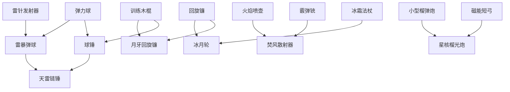

# 割草类小游戏武器系统、购买升级与合成设计

> 目标：替换当前偏资料表的枪械武器思路，设计一套更适合割草玩法的武器系统。武器可以是冷兵器、热武器或能量武器，但每把武器必须有明确差异，能和当前角色属性形成合理搭配，并支持购买、升级和合成。
>
> 武器图片、打击反馈、命中特效和素材交付规则见：`doc/ideas/割草类小游戏_武器图片与打击特效素材规范.md`。

## 1. 设计结论

第一版建议采用：

```text
1 把免费基础武器
+ 8 把金币购买武器
+ 5 把合成武器
+ 2 把终局合成武器
```

核心方向：

- 不再用一堆名字不同但手感相似的枪。
- 每把武器至少在 `攻击方式 / 攻击范围 / 攻击频率 / 特效 / 适配角色` 中有 2 项明显不同。
- 免费武器必须简单可靠，但后期成长上限普通。
- 金币购买武器负责扩展玩法。
- 合成武器负责制造长期目标和爽点。
- 合成第一版只消耗金币，不消耗已拥有武器，避免玩家误操作后变弱。

## 2. 武器核心参数

每把武器至少需要这些参数：

| 参数 | 说明 |
| --- | --- |
| `id` | 稳定配置 ID，不能随便改，避免破坏存档 |
| `name` | 展示名 |
| `family` | 武器系别：近战、投射、枪械、能量、爆破、控制 |
| `attackPattern` | 攻击模式：直线弹、扇形、近战扫击、环绕、抛物、光束、链式 |
| `baseDamage` | 1 级基础伤害 |
| `attacksPerSecond` | 每秒攻击次数，替代纯 RPM，更适合割草调参 |
| `range` | 攻击距离 |
| `areaRadius` | 范围伤害半径，没有范围伤害则为 0 |
| `pierce` | 穿透次数 |
| `knockback` | 击退强度 |
| `effectId` | 特效逻辑，如燃烧、冰冻、连锁、电击、弹跳 |
| `buyCost` | 金币购买价，免费武器为 0 |
| `upgradeCurve` | 升级成长模板 |
| `recipe` | 合成配方，没有则为空 |

代码落地时，不建议把复杂行为全放远程 JSON。远程配置只控制数值、权重、购买价格和开关，具体攻击模式仍由本地 `WeaponAttackPattern` 实现。

## 3. 武器成长规则

### 3.1 武器等级

建议每把武器最高 10 级：

```text
武器最终伤害 = baseDamage * 角色攻击倍率 * 角色等级攻击倍率 * 武器等级倍率
武器等级倍率 = 1 + (level - 1) * damageGrowth
攻击间隔 = baseInterval / (1 + (level - 1) * speedGrowth)
```

推荐默认成长：

| 武器类型 | 伤害成长 | 攻速成长 | 范围成长 | 说明 |
| --- | ---: | ---: | ---: | --- |
| 近战 | 10%/级 | 3%/级 | 3%/级 | 靠范围和击退成长 |
| 投射 | 8%/级 | 5%/级 | 2%/级 | 均衡成长 |
| 枪械 | 7%/级 | 7%/级 | 1%/级 | 靠射速成长 |
| 能量 | 9%/级 | 4%/级 | 3%/级 | 特效明显 |
| 爆破 | 12%/级 | 2%/级 | 4%/级 | 慢速大范围 |
| 控制 | 6%/级 | 4%/级 | 4%/级 | 伤害低但保命强 |

### 3.2 升级费用

```text
upgradeCost(level) = max(70, buyCost * 0.12) * 1.16^(level - 1)
```

合成武器的升级费用按结果武器价格计算，终局合成武器可以额外乘 `1.15`，避免后期成长过快。

## 4. 角色与武器适配

当前代码只注册 `runner / Male` 一个可选角色，所有武器都必须保证 Male 可用。下面的角色适配不再维护多角色差异，后续恢复多角色时再按真实 `CharacterDefinition` 补表。

| 角色 | 特点 | 推荐武器方向 |
| --- | --- | --- |
| Male | 标准属性 | 所有基础武器 |

设计约束：

- 当前武器池不要依赖特定非 Male 角色才能成立。
- `recommendedCharacterIds` 如果保留历史 id，只能作为未来扩展提示，不应影响当前购买、合成或战斗逻辑。

## 5. 第一版武器池

### 5.1 免费基础武器

| 武器 | 系别 | 伤害 | 攻速 | 范围 | 特效 | 定位 |
| --- | --- | ---: | ---: | ---: | --- | --- |
| 训练木棍 | 近战 | 10 | 1.20/s | 70 | 小击退 | 免费起手，稳定但上限普通 |

说明：

- 木棍不是远程弹，而是朝最近敌人方向扫击。
- 命中扇形区域，角度约 70 度。
- 适合让玩家一开始就理解“走位 + 自动攻击”。
- 5 级后扫击范围明显变宽，但不会变成强力武器。

### 5.2 金币购买武器

| 武器 | 价格 | 系别 | 伤害 | 攻速 | 范围 | 特效 | 适合角色 |
| --- | ---: | --- | ---: | ---: | ---: | --- | --- |
| 弹力球 | 180 | 投射 | 7 | 1.10/s | 260 | 命中后弹跳 1 次 | Male |
| 飞星镖 | 260 | 投射 | 8 | 1.45/s | 300 | 穿透 1 个敌人 | Male |
| 磁能短弓 | 360 | 投射 | 13 | 0.85/s | 380 | 轻微追踪 | Male |
| 回旋镰 | 520 | 近战 | 9 | 1.00/s | 95 | 返回路径二次伤害 | Male |
| 火花手枪 | 620 | 枪械 | 5 | 3.60/s | 330 | 暴击小火花 | Male |
| 冰霜法杖 | 760 | 控制 | 8 | 0.95/s | 320 | 减速 25%，持续 1 秒 | Male |
| 霰弹铳 | 900 | 枪械 | 6x5 | 0.70/s | 230 | 扇形散射 | Male |
| 雷针发射器 | 1080 | 能量 | 11 | 0.80/s | 360 | 命中后链到 1 个目标 | Male |
| 火焰喷壶 | 1180 | 能量 | 4 | 5.00/s | 160 | 燃烧地面 1.5 秒 | Male |
| 小型榴弹炮 | 1450 | 爆破 | 26 | 0.38/s | 420 | 爆炸半径 80 | Male |

### 5.3 合成武器

| 合成武器 | 配方 | 金币 | 系别 | 伤害 | 攻速 | 范围 | 特效 |
| --- | --- | ---: | --- | ---: | ---: | ---: | --- |
| 球锤 | 训练木棍 + 弹力球 | 220 | 近战 | 18 | 0.90/s | 95 | 扇形重击，击退更强 |
| 月牙回旋镰 | 训练木棍 + 回旋镰 | 520 | 近战 | 15 | 1.05/s | 125 | 回旋两段伤害，外圈高伤 |
| 雷暴弹球 | 弹力球 + 雷针发射器 | 760 | 能量 | 12 | 1.05/s | 340 | 弹跳时释放小电弧 |
| 焚风散射器 | 霰弹铳 + 火焰喷壶 | 920 | 枪械 | 5x6 | 0.75/s | 250 | 扇形燃烧弹 |
| 冰月轮 | 冰霜法杖 + 回旋镰 | 1050 | 控制 | 14 | 0.85/s | 145 | 环形冰刃，减速并切割 |

### 5.4 终局合成武器

| 终局武器 | 配方 | 金币 | 定位 | 特效 |
| --- | --- | ---: | --- | --- |
| 天雷链锤 | 球锤 + 雷暴弹球 | 1800 | 高攻近战终局 | 每 4 次重击召唤落雷，当前角色 Male 可用 |
| 星核榴光炮 | 磁能短弓 + 小型榴弹炮 | 2200 | 远程爆破终局 | 远距离爆炸，爆心有二段吸附，当前角色 Male 可用 |

终局武器不是必须比所有武器都通用，而是让玩家有明确追求。它们应该强，但升级贵、攻速低或风险高。

## 6. 武器攻击模式

| 攻击模式 | 说明 | 第一版实现方式 |
| --- | --- | --- |
| `meleeSweep` | 朝最近敌人扇形扫击 | Flame 中做扇形范围检测和刀光弧线 |
| `projectile` | 直线弹 | 沿用当前 `ProjectileComponent` |
| `bouncingProjectile` | 弹跳弹 | 命中后重新选附近目标生成下一段 |
| `boomerang` | 飞出去再返回 | 用自定义 Component 记录往返时间 |
| `coneShot` | 扇形多弹 | 一次生成多枚弹 |
| `beam` | 短时光束 | 线段碰撞，持续 0.15-0.35 秒 |
| `lobbedExplosion` | 抛物爆炸 | 弹体到达目标点后范围伤害 |
| `chainLightning` | 链式命中 | 目标之间递归跳转，上限 2-5 |
| `flameStream` | 近距离持续喷射 | 高频低伤害，地面火焰持续伤害 |
| `orbitSlash` | 环绕切割 | 复用环刃类逻辑，但作为武器基础攻击 |

## 7. 武器特效设计

| 武器 | 特效表现 |
| --- | --- |
| 训练木棍 | 黄色半月弧线，命中时小尘土 |
| 弹力球 | 彩色拖尾，弹跳时小星星 |
| 飞星镖 | 蓝白短尾迹，穿透时闪一下 |
| 磁能短弓 | 箭头有轻微吸附曲线，命中有蓝色脉冲 |
| 回旋镰 | 飞出和返回两段绿色弧光 |
| 火花手枪 | 高频小火星，暴击时橙色爆点 |
| 冰霜法杖 | 冰蓝弹体，命中生成雪花圈 |
| 霰弹铳 | 扇形火光，多条短尾迹 |
| 雷针发射器 | 紫蓝电针，链路用锯齿电线 |
| 火焰喷壶 | 近距离火舌，地面残留火圈 |
| 小型榴弹炮 | 慢速炮弹，落点先出现警示圈再爆炸 |
| 球锤 | 大号重击弧线，命中有冲击波 |
| 雷暴弹球 | 弹跳点释放小落雷 |
| 星核榴光炮 | 爆心吸附，外圈星光碎片 |

特效原则：

- 高频武器特效要轻，避免满屏噪音。
- 低频武器特效要重，命中反馈必须明显。
- 冷兵器用弧线和冲击波，热武器用尾迹和爆点，能量武器用光圈和电链。

## 8. 购买功能设计

### 8.1 页面结构

武器页面建议分 4 个 Tab：

```text
已拥有
商店
合成
图鉴
```

商店卡片展示：

- 武器图标。
- 武器名称和系别。
- 攻击、攻速、范围三个核心数值。
- 一句定位文案，例如“高速弹跳，适合风筝”。
- 价格按钮。

### 8.2 购买规则

```text
如果 buyCost = 0：默认拥有
如果金币 >= buyCost：购买成功，扣金币，武器加入已拥有
如果金币不足：提示金币不足
已购买武器不能重复购买
购买后可立即装备
```

建议第一版不要做抽卡，不要做碎片，直接金币购买最清晰。

### 8.3 价格节奏

| 阶段 | 价格区间 | 目标 |
| --- | ---: | --- |
| 新手 | 0-360 | 1-3 局能买到第一把不同手感武器 |
| 前期 | 520-900 | 打通 1-3 或 1-4 后开始选择路线 |
| 中期 | 1080-1450 | 需要多局积累，形成目标 |
| 合成 | 220-1050 | 依赖已有武器，价格低于直接买强武器 |
| 终局 | 1800-2200 | 长线追求 |

结合当前前 5 关金币奖励，第一章通关过程大约可以解锁 2-4 把普通武器，再开始合成路线。

## 9. 合成系统设计

### 9.1 第一版规则

```text
合成条件 = 拥有配方要求武器 + 金币足够
合成消耗 = 金币
不消耗原武器
合成结果 = 解锁新武器，等级从 1 开始
```

不消耗原武器的原因：

- 玩家不会因为试错失去已有战力。
- UI 不需要复杂二次确认。
- 后续如果要做消耗材料，可以加“合成矿石”而不是吃掉武器。

### 9.2 合成 UI

合成页每个配方展示：

```text
结果武器
  = 材料武器 A + 材料武器 B + 金币
```

状态分 4 种：

| 状态 | 按钮 |
| --- | --- |
| 材料未拥有 | 去获取 |
| 金币不足 | 金币不足 |
| 可合成 | 合成 |
| 已合成 | 已拥有 / 装备 |

### 9.3 合成路线



## 10. 推荐首批配置表

| id | 名称 | 获得 | 价格 | 伤害 | 攻速 | 范围 | 模式 | 特效 |
| --- | --- | --- | ---: | ---: | ---: | ---: | --- | --- |
| `wooden_stick` | 训练木棍 | 免费 | 0 | 10 | 1.20 | 70 | `meleeSweep` | 击退 |
| `bounce_ball` | 弹力球 | 购买 | 180 | 7 | 1.10 | 260 | `bouncingProjectile` | 弹跳 |
| `star_dart` | 飞星镖 | 购买 | 260 | 8 | 1.45 | 300 | `projectile` | 穿透 |
| `magnet_bow` | 磁能短弓 | 购买 | 360 | 13 | 0.85 | 380 | `projectile` | 轻追踪 |
| `return_sickle` | 回旋镰 | 购买 | 520 | 9 | 1.00 | 95 | `boomerang` | 返回伤害 |
| `spark_pistol` | 火花手枪 | 购买 | 620 | 5 | 3.60 | 330 | `projectile` | 暴击火花 |
| `frost_staff` | 冰霜法杖 | 购买 | 760 | 8 | 0.95 | 320 | `projectile` | 减速 |
| `scatter_blunder` | 霰弹铳 | 购买 | 900 | 6x5 | 0.70 | 230 | `coneShot` | 散射 |
| `thunder_needle` | 雷针发射器 | 购买 | 1080 | 11 | 0.80 | 360 | `chainLightning` | 电链 |
| `flame_sprayer` | 火焰喷壶 | 购买 | 1180 | 4 | 5.00 | 160 | `flameStream` | 燃烧 |
| `mini_grenade` | 小型榴弹炮 | 购买 | 1450 | 26 | 0.38 | 420 | `lobbedExplosion` | 爆炸 |
| `ball_hammer` | 球锤 | 合成 | 220 | 18 | 0.90 | 95 | `meleeSweep` | 重击 |
| `moon_sickle` | 月牙回旋镰 | 合成 | 520 | 15 | 1.05 | 125 | `boomerang` | 外圈高伤 |
| `storm_ball` | 雷暴弹球 | 合成 | 760 | 12 | 1.05 | 340 | `bouncingProjectile` | 弹跳电弧 |
| `flame_scatter` | 焚风散射器 | 合成 | 920 | 5x6 | 0.75 | 250 | `coneShot` | 扇形燃烧 |
| `ice_moon` | 冰月轮 | 合成 | 1050 | 14 | 0.85 | 145 | `orbitSlash` | 环形减速 |
| `storm_hammer` | 天雷链锤 | 终局合成 | 1800 | 26 | 0.72 | 115 | `meleeSweep` | 重击落雷 |
| `star_core_cannon` | 星核榴光炮 | 终局合成 | 2200 | 34 | 0.32 | 460 | `lobbedExplosion` | 吸附爆炸 |

## 11. 代码落地建议

### 11.1 数据模型

建议把当前 `WeaponDefinition` 扩展为：

```dart
class WeaponDefinition {
  final String id;
  final String name;
  final String family;
  final WeaponAttackPattern attackPattern;
  final int buyCost;
  final int baseDamage;
  final double attacksPerSecond;
  final double range;
  final double areaRadius;
  final int pierce;
  final double knockback;
  final String effectId;
  final WeaponUpgradeCurve upgradeCurve;
  final WeaponRecipe? recipe;
  final List<String> recommendedCharacterIds;
}
```

`WeaponProgress` 建议增加：

```dart
final bool isCrafted;
final int maxLevel;
```

第一版可以先不做材料背包，只通过 `ownedWeapons + coins` 判断合成。

### 11.2 运行时

`GrassSurvivorGame` 不应该只接收 `weaponDamage / weaponCooldownMultiplier / weaponKind`，后续应接收一个已计算好的运行时快照：

```dart
class WeaponRuntimeStats {
  final WeaponAttackPattern attackPattern;
  final int damage;
  final double attacksPerSecond;
  final double range;
  final double areaRadius;
  final int pierce;
  final double knockback;
  final String effectId;
}
```

然后在 Flame 内按 `attackPattern` 分发到不同攻击实现。

### 11.3 分阶段落地

第一阶段：

- 替换当前前 20 把枪械目录为新武器池。
- 保留购买、选择、升级按钮。
- 暂时用现有图标占位。
- 先实现 `projectile / coneShot / lobbedExplosion` 三种模式。

第二阶段：

- 实现 `meleeSweep / bouncingProjectile / boomerang`。
- 上线合成页。
- 增加合成配方状态和合成按钮。

第三阶段：

- 实现 `chainLightning / flameStream / orbitSlash`。
- 做终局合成武器。
- 替换正式武器图标、弹体、命中特效。

## 12. 验收标准

- 免费木棍能通 1-1，但通 1-3 开始明显吃力。
- 玩家 2-3 局内能买到第一把不同手感武器。
- 每把武器在试玩 20 秒内能感受到差异。
- 高速角色使用近战/弹跳武器有收益，低速角色使用远程/控制武器更安全。
- 合成武器不是纯数值更高，而是攻击形态变了。
- 终局武器强但不通用，不能让所有角色都只选同一把。
